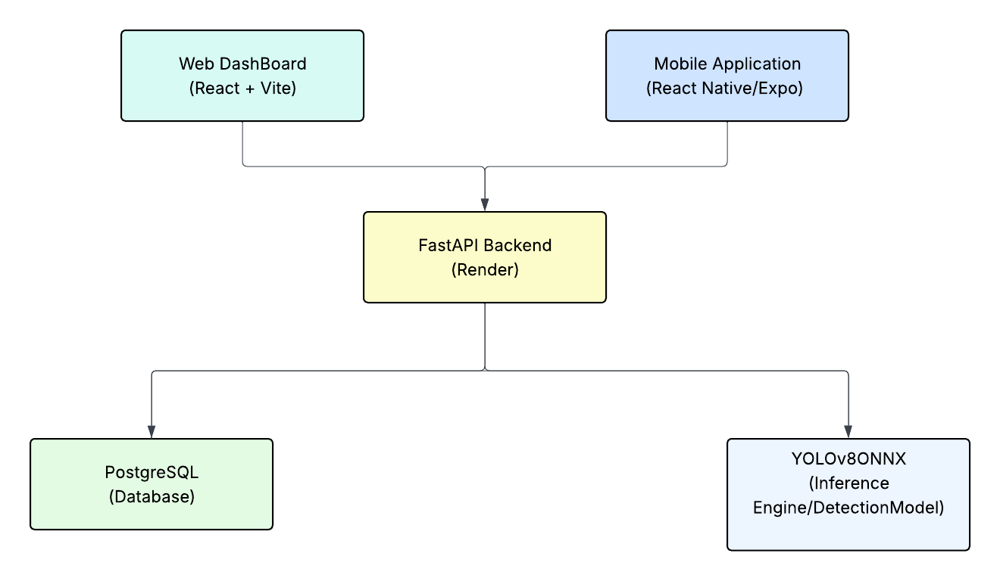

# Auto-Vision
**AI-Powered Vehicle Detection and Monitoring System**

---

## 1. Project Description

Auto-Vision is a vehicle detection and monitoring system developed to support real-time traffic and vehicle classification in Philippine road environments. The system employs a custom-trained YOLOv8 model specifically built to recognize eight locally common vehicle types — including jeepneys and tricycles not found in standard datasets — and delivers live detection, classification, and logging across three interconnected components: a React web dashboard, an Expo mobile application, and a FastAPI backend that serves both the core REST API and the ONNX-based ML inference engine. Detections are stored persistently, aggregated into statistics, and made available across all platforms through a unified API deployed on Render.

---

## 2. Features

- **Dashboard** — real-time summary cards for total detections per vehicle type, active camera devices, and session-level statistics
- **Live camera detection** — captures camera frames every 300 ms, uploads to the backend, and renders color-coded bounding boxes on a canvas overlay in real time
- **Vehicle classification** — identifies eight Philippine vehicle classes: Bicycle, Bus, Car, Jeepney, Motorcycle, Tricycle, Truck, Van
- **Detection logs** — historical record of every detected vehicle with label, confidence score, bounding box coordinates, frame number, device, and timestamp
- **Detection statistics** — aggregated counts per vehicle type and per session with average confidence tracking
- **Session recording** — save complete detection sessions with video upload to Cloudinary CDN for later review
- **Device management** — register, update status, and remove IP camera devices by name and location
- **User management** — manage system accounts with role-based access control (Admin, Viewer)
- **Audit logging** — append-only audit trail of all user actions across the system
- **Cross-platform** — identical feature set available on browser (React + Vite) and mobile (React Native + Expo, iOS/Android)

---

## 3. Technology Stack

### 3.1 Web Application

| Field | Detail |
|-------|--------|
| Project name | Auto-Vision |
| Framework | React (Vite, JavaScript) |
| Build tool | Vite — `npm run dev` / `npm run build` |
| Key pages | Dashboard, LiveCamera, DetectionLogs, DeviceManagement, UserManagement, Login, Signup, MultiCamera |
| Detection hook | `useDetection.js` — frame capture, canvas rendering, bounding box drawing |
| State / context | `useAutoVision.js` — camera init and form state; `App.jsx` — global app state |
| API calls | `detectionService.js` — all REST calls to FastAPI at `VITE_API_URL` |
| ML (client-side) | TensorFlow.js + COCO-SSD (unused in production — inference runs on backend) |

### 3.2 Mobile Application

| Field | Detail |
|-------|--------|
| Project name | Auto-VisionMobile-App |
| Framework | React Native — Expo SDK 54.0.34 |
| Language | TypeScript 5.9.2 |
| Run commands | `npx expo start` / `npm run android` / `npm run ios` |
| Key screens | Dashboard, LiveCamera, DetectionLogs, DeviceManagement, UserManagement, Login, Signup |
| Styling | NativeWind 2.0.11 + Tailwind CSS 3.3.2 |
| HTTP client | Axios 1.6.8 — typed endpoints in `src/service/api.ts` |
| State / context | `useAutoVision.ts` — camera permissions and form state |

### 3.3 Backend — FastAPI

| Field | Detail |
|-------|--------|
| Framework | FastAPI — Python + Uvicorn |
| Run command | `uvicorn main:app --reload` |
| API prefix | `/api` |
| Swagger docs | `http://127.0.0.1:8000/docs` |
| Core routers | `/auth`, `/devices`, `/users`, `/detection`, `/audit-logs` |
| ML router | `/detection/detect` — see Section 3.4 |

### 3.4 ML Detection Layer

The ML layer is embedded inside the FastAPI backend. The ONNX model (`best.onnx`) is loaded at server startup inside `detector.py`. Train the model using the provided Jupyter notebook (`YOLOv8Vehicle (1).ipynb`) before first deployment.

| Field | Detail |
|-------|--------|
| Endpoint | `POST /api/detection/detect` |
| Model architecture | YOLOv8 (exported to ONNX format) |
| Input | Multipart JPEG image upload |
| Preprocessing | OpenCV decode → letterbox resize to 640×640 → normalize to [0, 1] → CHW transpose |
| Confidence threshold | 0.25 |
| NMS IoU threshold | 0.45 |
| Output classes | 8 — Bicycle, Bus, Car, Jeepney, Motorcycle, Tricycle, Truck, Van |
| Output format | JSON detections + base64-encoded annotated image (JPEG quality 92) |
| Model files | `models/best.onnx`, `models/best.pt` (PyTorch backup) |

### 3.5 Database

| Field | Detail |
|-------|--------|
| Engine | PostgreSQL (production) / SQLite — `db.sqlite3` (development fallback) |
| ORM | SQLAlchemy (declarative base) |
| Tables | `auth_user`, `api_device`, `api_systemuser`, `api_detectionsession`, `api_detectionlog`, `api_auditlog` |

---

## 4. Dataset

### 4.1 Overview

The YOLOv8 model was trained on a Philippine vehicle dataset sourced from Roboflow, containing annotated bounding-box images of vehicles commonly found on Philippine roads. The dataset was selected specifically to include vehicle types absent from standard COCO/ImageNet datasets — particularly jeepneys and tricycles, which are unique to the Philippine road environment. Training was performed on Google Colab using a Tesla T4 GPU via the Ultralytics YOLOv8 framework.

| Field | Detail |
|-------|--------|
| Source platform | Roboflow |
| Workspace | `new-workspace-7dikm` |
| Project | `vehicle-b7rud` |
| Version | 2 |
| Annotation format | YOLOv8 (normalized XYWH bounding boxes per class) |
| Total extracted files | 21,066 |
| Validation set images | 248 |
| Training notebook | `YOLOv8Vehicle (1).ipynb` |
| Training platform | Google Colab |
| Training hardware | Tesla T4 GPU (14 GB VRAM) |

### 4.2 Annotation Format

Each image in the dataset is paired with a `.txt` annotation file in YOLO format. Every line in the annotation file represents one object instance:

```
<class_id> <x_center> <y_center> <width> <height>
```

All coordinates are normalized to the range [0, 1] relative to image width and height. Class IDs map to the eight vehicle types as defined in `data.yaml`.

| Field | Description |
|-------|-------------|
| class_id | Integer index (0–7) mapped to the vehicle class |
| x_center | Horizontal center of bounding box, normalized (0–1) |
| y_center | Vertical center of bounding box, normalized (0–1) |
| width | Bounding box width, normalized (0–1) |
| height | Bounding box height, normalized (0–1) |

### 4.3 Vehicle Classes

| Class ID | Class | Description | Validation Images | Instances |
|----------|-------|-------------|-------------------|-----------|
| 0 | Bicycle | Non-motorized two-wheeled vehicle | 8 | 8 |
| 1 | Bus | Large multi-passenger transport vehicle | 14 | 14 |
| 2 | Car | Standard passenger automobile | 35 | 35 |
| 3 | Jeepney | Philippine iconic public utility jeepney | 34 | 34 |
| 4 | Motorcycle | Motorized two-wheeled vehicle | 37 | 37 |
| 5 | Tricycle | Motorcycle with attached passenger sidecar | 44 | 44 |
| 6 | Truck | Large cargo or utility vehicle | 38 | 38 |
| 7 | Van | Multi-purpose passenger or cargo van | 38 | 38 |

### 4.4 Training Configuration

| Parameter | Value |
|-----------|-------|
| Base model | YOLOv8n (nano — lightweight, optimized for speed) |
| Architecture | 73 layers, 3,007,208 parameters, 8.1 GFLOPs |
| Epochs | 20 |
| Input image size | 640 x 640 px |
| Optimizer | Auto (AdamW default via Ultralytics) |
| Framework | Ultralytics 8.4.47 + PyTorch 2.10.0+cu128 |
| Export format | ONNX (for CPU inference via ONNX Runtime) |

### 4.5 Default Data Augmentation

YOLOv8 applies the following augmentations automatically during training to improve generalization:

| Augmentation | Description |
|--------------|-------------|
| Mosaic | Combines 4 training images into one — increases scene diversity |
| HSV jitter | Random hue, saturation, and brightness shifts |
| Random flip | Horizontal flip with 50% probability |
| Scale | Random scaling of image size |
| Translate | Random image translation |
| Perspective | Slight perspective distortion |
| Mixup | Blends two images and their labels at a low probability |

### 4.6 Inference Configuration

| Parameter | Value |
|-----------|-------|
| Input size | 640 x 640 px |
| Preprocessing | Letterbox resize → normalize to [0, 1] → CHW format |
| Confidence threshold | 0.25 |
| NMS IoU threshold | 0.45 |
| Runtime | ONNX Runtime (CPU) |
| Output | Bounding boxes (x1, y1, x2, y2) + class label + confidence score |

### 4.7 Model Performance

Validation results on 248 images evaluated against `best.pt`:

| Class | Precision | Recall | mAP@50 | mAP@50-95 |
|-------|-----------|--------|--------|-----------|
| **All (overall)** | **0.811** | **0.854** | **0.902** | **0.839** |
| Bicycle | 0.762 | 1.000 | 0.899 | 0.734 |
| Bus | 1.000 | 0.868 | 0.990 | 0.960 |
| Car | 0.644 | 0.829 | 0.805 | 0.784 |
| Jeepney | 0.834 | 0.738 | 0.935 | 0.870 |
| Motorcycle | 0.717 | 0.649 | 0.783 | 0.624 |
| Tricycle | 0.766 | 0.820 | 0.877 | 0.839 |
| Truck | 0.842 | 0.980 | 0.939 | 0.926 |
| Van | 0.923 | 0.951 | 0.985 | 0.973 |

**Inference speed (Tesla T4 GPU):** 1.8ms preprocess + 3.6ms inference + 1.5ms postprocess per image

Note: Motorcycle has the lowest mAP (0.783) due to visual similarity with tricycles. Bus achieves perfect precision (1.000) owing to its distinct silhouette.

### 4.8 Bounding Box Color Codes

| Class | Color |
|-------|-------|
| Bicycle | Orange |
| Bus | Red |
| Car | Green |
| Jeepney | Magenta |
| Motorcycle | Yellow |
| Tricycle | Cyan |
| Truck | Purple |
| Van | Sky Blue |

---

## 5. System Architecture



```
┌─────────────────────┐         ┌──────────────────────┐
│   Web Dashboard     │         │     Mobile App       │
│  React + Vite       │         │  React Native/Expo   │
│  (Browser)          │         │  (iOS / Android)     │
└──────────┬──────────┘         └──────────┬───────────┘
           │                               │
           │          HTTP REST API        │
           └───────────────┬───────────────┘
                           ↓
              ┌────────────────────────┐
              │     FastAPI Backend    │
              │   Render.com Cloud     │
              │ avfa.onrender.com/api  │
              └────────────┬───────────┘
                           │
           ┌───────────────┼───────────────┐
           ↓               ↓               ↓
    ┌─────────────┐  ┌──────────────┐  ┌────────────┐
    │ PostgreSQL  │  │  YOLOv8      │  │ Cloudinary │
    │  Database   │  │  ONNX        │  │    CDN     │
    │ (Logs, Users│  │  Inference   │  │  (Session  │
    │  Devices)   │  │  Engine      │  │  Videos)   │
    └─────────────┘  └──────────────┘  └────────────┘
```

**Vehicle Detection Flow:**

```
Camera Frame Captured (every 300 ms)
        ↓
POST /api/detection/detect  (multipart JPEG upload)
        ↓
OpenCV decode → Letterbox resize to 640×640 → Normalize → CHW
        ↓
YOLOv8 ONNX Inference
        ↓
Confidence Filter (≥ 0.25) → Non-Maximum Suppression (IoU 0.45)
        ↓
Bounding boxes drawn on annotated image
        ↓
Detection entry saved to api_detectionlog table
        ↓
Response: detections JSON + base64 annotated image
        ↓
Frontend renders bounding boxes on canvas overlay
```

---

<<<<<<< HEAD
## 6. Installation & Setup

### 6.1 Requirements
=======

    

## 7. Installation & Setup

### 7.1 Requirements
>>>>>>> 2459113 (Update README.md)

- Python 3.10+
- Node.js 18+
- Expo CLI (`npm install -g expo-cli`)
- PostgreSQL (optional — defaults to SQLite for local development)

### 6.2 Backend Setup (FastAPI)

```bash
git clone https://github.com/[repo]/avfastapi.git
cd avfastapi

python -m venv venv
source venv/bin/activate          # Windows: venv\Scripts\activate
pip install -r requirements.txt

# Configure environment variables
cp .env.example .env
# Edit .env — fill in:
#   DATABASE_URL (optional, defaults to SQLite)
#   CLOUDINARY_CLOUD_NAME
#   CLOUDINARY_API_KEY
#   CLOUDINARY_API_SECRET

# Train the model once (generates best.onnx / best.pt inside models/)
# Open and run YOLOv8Vehicle (1).ipynb — or copy pre-trained model files

uvicorn main:app --reload --host 0.0.0.0 --port 8000
```

### 6.3 Web App Setup

```bash
git clone https://github.com/[repo]/Auto-Vision.git
cd Auto-Vision

npm install

# Create .env
echo VITE_API_URL=http://localhost:8000/api > .env

npm run dev
```

### 6.4 Mobile App Setup

```bash
git clone https://github.com/[repo]/Auto-VisionMobile-App.git
cd Auto-VisionMobile-App

npm install

# Create .env — use your machine's LAN IP so physical devices can reach the server
echo EXPO_PUBLIC_API_URL=http://<your-local-ip>:8000/api > .env

npx expo start
```

> When running on a physical device, use your machine's LAN IP address in `EXPO_PUBLIC_API_URL` — not `localhost`.

---

## 7. Deployment Links

| Service | URL |
|---------|-----|
| Web app (dev) | http://localhost:5173 |
| Mobile app | Scan the Expo QR code — device must be on the same LAN as the server |
| FastAPI REST | https://avfa.onrender.com/api |
| Swagger UI | https://avfa.onrender.com/docs |
| Roboflow dataset | https://roboflow.com — project: `philippine-vehicles-combined-sa0yj` |

---

## 8. Test Account

A default admin account is available for testing:

| Field | Value |
|-------|-------|
| Email | veej@gmail.com |
| Password | Admin123 |
| Role | Admin |

Additional roles available: Viewer. All accounts can be managed from the User Management screen (Admin only).

---

## 9. Team Members and Roles

| Name | Role / Modules |
|------|----------------|
| Keith Andrae Trazares | [Modules] |
| Dave Adryanne Salem | [Modules] |

---

## 10. Known Limitations

- **No JWT / token expiry** — authentication is not production-secure; tokens are not implemented
- **Plain-text passwords** — passwords are not hashed in the demo build; apply bcrypt before any production deployment
- **Hardcoded API URL** — `VITE_API_URL` and `EXPO_PUBLIC_API_URL` must be updated manually per environment
- **CPU-only ONNX inference** — no GPU acceleration; inference speed depends on server CPU
- **No live stream support** — detection works on individual frames only; true video streaming requires additional implementation
- **No offline support** — mobile app requires an active connection to the FastAPI server
- **Render.com cold starts** — the free-tier backend may take 30–60 seconds to respond after a period of inactivity
